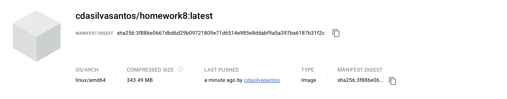

# Devops Demo 
## Homework 8 - IS219 - Spring 2024

### About
This repository showcases the utilization of Docker for constructing images and integrating Pytest for testing within a Dockerized environment. With Docker, developers can simplify the deployment of their applications, ensuring uniformity across diverse environments. Pytest, a widely-used Python testing framework, facilitates effective and scalable code testing.

### Screenshots

